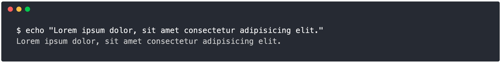
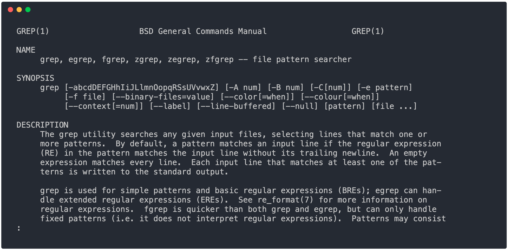

# TerminalUI

Simple and lightweight terminal UI component.




## Installation

```
npm install @piopli/terminal-ui
```

## Usage

Example:

```html
<div data-terminalui>
  <div data-terminalui-command>
    echo "Lorem ipsum dolor, sit amet consectetur adipisicing elit."
  </div>
  <div data-terminalui-output>
    Lorem ipsum dolor, sit amet consectetur adipisicing elit.
  </div>
</div>
```

You can use CSS-only version or include JavaScript to get some dynamic functionality.

### CSS-only

Just include `styles.css` file in your project.

### JavaScript

```javascript
import terminalui from '@piopli/terminal-ui';
```

```javascript
const terminal = terminalui();
terminal.init();
```

## Configuration

Available options:

- `selector` - custom selector to handle only selected TerminalUI objects with created instance
- `prompt` - custom terminal prompt, default: `$`

Example configuration:

```javascript
const terminal = terminalui({
  selector: '.custom-terminalui-selector',
  prompt: '>',
});
```
